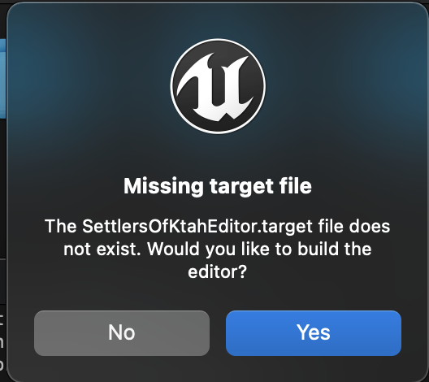
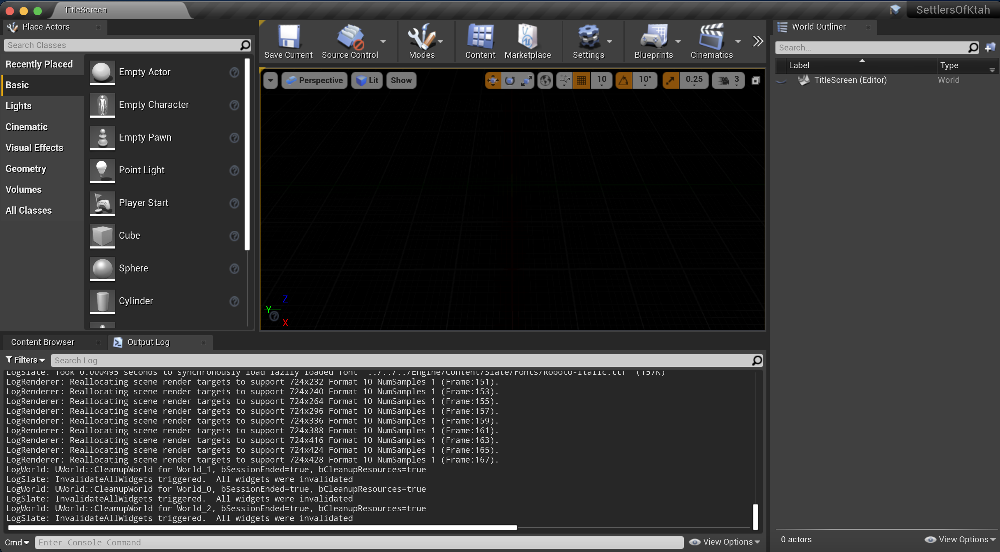
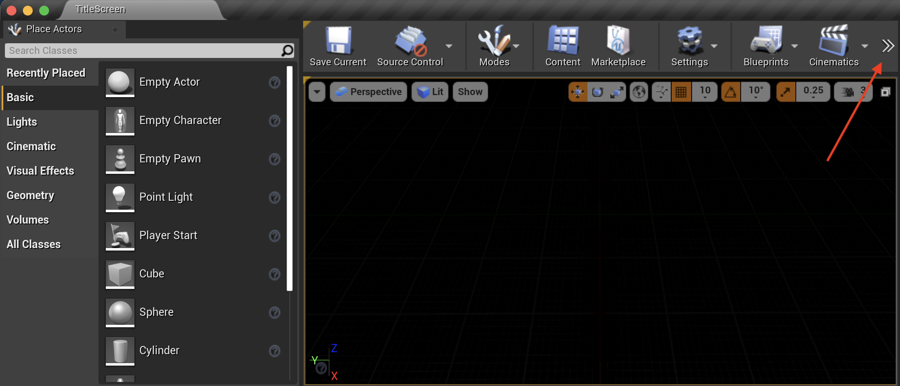
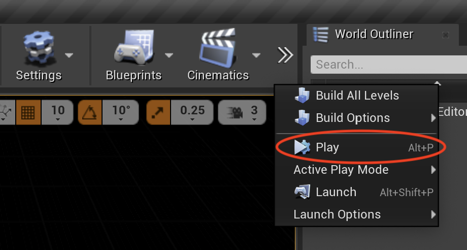
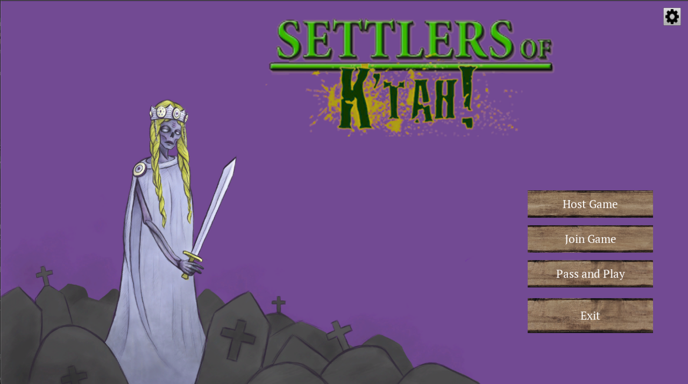
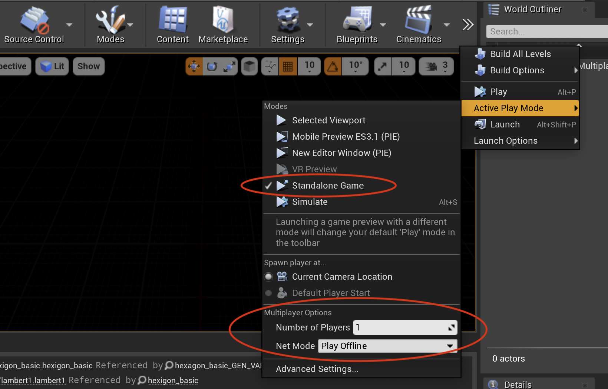

# Settlers of K'tah

## About
Settlers of K'tah is a turn-based multiplayer video board game inspired by Settlers of Catan and the K'tah game series!  
It is a combined effort between the LMU computer science and animation departments, with a development team comprising of four LMU Class of 2021 students. Settlers of K'tah is themed around zombies and survival, with 2-4 players competing and collaborating to collect resources, build buildings and armies, and more!  
Read more about Settlers of K'tah in our game design document here: [https://bit.ly/lmu-sok](https://bit.ly/lmu-sok).  
You can also find the user manual for Settlers of K'tah [here](./assignments/manual.md).

## Development Team
Programming: Maddie Louis & Merissa Tan  
Animation: Kaitlyn Behrens & Haley Mech  
Advisors: Dr. Andrew Forney & Josh Morgan  
Music: Owen Mech  

## How to Install Settlers of K'tah
At the time when this document is written, Settlers of K'tah is not hosted on any site. An exported version of the game is available only to a small set of test players. However, the application's repository is public, and users can clone the repository and play the game through the Unreal Engine editor by following the instructions below.

### Downloading and Installing Unreal Engine

To download and install Unreal Engine, follow the instructions [here](https://www.unrealengine.com/en-US/download) and select the Creators License. You might be prompted to log onto an Epic Games account. If you do not already have an Epic Games account, feel free to create one with your email, or simply link Epic Games to your existing Google, Facebook, Xbox Live, Playstation Network, Nintendo, Steam, or Apple account.

The downloaded file's extension will vary based on your operating system. Once the download completes, simply install the application based on how you would install any application onto your operating system.  
For reference, here is a quick external guide on how to install applications on [Windows](https://www.computerhope.com/issues/ch000561.htm#windows) and [Mac](https://support.apple.com/guide/mac-help/install-and-uninstall-other-apps-mh35835/mac).

### Cloning the Settlers of K'tah Repository

Navigate to the command line interface on your operating system (Terminal on Mac, Command Prompt on Windows), and run the following command. This command will download the Settlers of K'tah repository onto your computer and allow you to open the project in Unreal Engine. Note that this might take a few minutes to run because the repository contains a large amount of rendered assets and package contents.
```
git clone https://github.com/mlouis2/Settlers-Of-Ktah.git
```

Once the clone is complete, navigate to the folder where you cloned the repository, and you should see the Settlers of K'tah Unreal project (`SettlersOfKtah.uproject`) in `Settlers-of-Ktah > src > SettlersOfKtah`.  

## How to Start Settlers of K'tah

Once you have completed the Unreal Engine installation, simply navigate to the Settlers of K'tah project file (directions above) and open the application. When you open Unreal Engine for the first time, the application might prompt you to create an Epic Games account. Simply log in with the method you used to create your account when downloading Unreal Engine.  

You might also see the following error, or something similar to it:  
  
Do not be alarmed! Your computer simply does not have the necessary build files to run Settlers of K'tah at the moment, so go ahead and click `Yes` and Unreal Engine will build those required components for you.

If all is well, you should see the following screen.  
  

To start the application in the editor, we will hit `Play` in Unreal Engine. If you do not see the `Play` button in the top panel, you might need to expand the panel first.  
  

Hit `Play` or use the `Alt-P` shortcut to start the Settlers of K'tah application.  
  

You should then be greeted by the Settlers of K'tah title screen.   
  

From the title screen, click the `Pass and Play` button to launch the pass and play version of Settlers of K'tah.  
If you wish to test a local multiplayer game on your machine, you must first set up the launch for multiplayer.  
  
Before you hit `Play`, expand the `Active Play Mode` menu and choose `Standalone Game` under `Modes`. Then, navigate to the `Multiplayer Options` section, select the number of players (2 - 4 for multiplayers) and change `Net Mode` to `Play as Clients`. Hit `Play` and you should now be able to host and join multiplayer games via the `Host Game` and `Join Game` buttons on the title screen!

## How to Stop Settlers of K'tah

Whenever the Settlers of K'tah application is running in Unreal Engine, you can stop it by navigating to the same place where the `Play` button is, and hit the `Stop` button. You may also hit the `Escape` key on your keyboard to stop the application at any time, unless the application was launched in standalone mode.  

## How to Uninstall Settlers of K'tah

To uninstall Settlers of K'tah, simply quit the Unreal Engine application, navigate to the directory where you [cloned the repo](#cloning-the-settlers-of-ktah-repository) and delete the `Settlers-of-Ktah` directory. If you wish to uninstall Unreal Engine from your machine, please follow the appropriate instructions for uninstalling applications on your operating system.  

For reference, here is a quick external guide on how to uninstall applications on [Windows](https://www.cnet.com/how-to/how-to-uninstall-an-app-or-program-in-windows-10/) and [Mac](https://support.apple.com/guide/mac-help/install-and-uninstall-other-apps-mh35835/mac).
