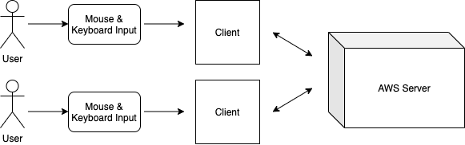

# 6.1 Introduction  
This document outlines the overall architecture of Settlers of K'tah, a multiplayer video board game that is being created in Unreal Engine. Specifically, we outline the various interfaces available at each level of the project as well as the software components and their interactions with one another.

## 6.1.1 System Objectives  

The objective of this application is to provide fun and exciting turn-based gameplay to users of all experience levels. The application integrates new and unexpected twists into the gameplays of Settlers of Catan and K'tah so that fans of these games will recognize certain familiar elements but still find the game to be exciting. The multi-player element of the application allows users to socially engage with other players by playing the game together. In addition, the clean and eye-catching graphic elements of the application allows users to experience high-quality gameplay. The various paths to victory in the game also provides freedom for the users to be creative and employ different gameplay strategies.

## 6.1.2 Hardware, Software, and Human Interfaces  
Hardware Interfaces  
- Wireless networking will be the primary connection for the server.  

Software Interfaces  
- Although it is a stretch goal for the semester, we are planning on using an AWS server in order to support local and/or online multiplayer and lobby creation. Unreal Engine internally handles many of the specific software interactions between the game and the server, so we will set up an EC2 instance and then connect it through Unreal's multiplayer configuration settings.  

Human Interfaces  
- Mouse - The user will use the mouse in order to click on game pieces and UI elements on the screen throughout the entire game.  
- Keyboard - The user will use the keyboard primarily in the zombie attack minigame, since that will require directional movement issued through keypresses.  

# 6.2 Architectural Design  

- Gameflow Control   
    - Game phases: Initial placement phase, turns phase, end phase
    - Turn-based gameplay logic
    - Mini-game (triggered by certain events)
- User Interface / Player Control
    - Title screen interactions
    - Multi-player interactions, e.g. trading
    - Building (castles, outposts, roads, etc.) purchases and placements
- Gameplay Logic
    - Resource generation and collection
    - Building restrictions, e.g. outposts locations
    - Victory progress

## 6.2.1 Major Software Components  
- Gameflow Control / Game Logic - The gameflow control component tracks knowledge that is relevant to the game as a whole (aka information that is not player-specific), such as which player's turn it is, which phase of the game the players are in, and what needs to happen next in order for the game to progress.
- Player - The player component keeps track of information that is specific to each player, such as the player's buliding locations on the hex grid map and current number of resources.
- Hex grid - The hex grid component holds knowledge relevant to all components of the grid map, such as castle and outpost locations, resources, and more.
- Map components (vertex, edge, tile) - Individual map components (namely vertices, edges, and tiles) track information that is relevant to them, including whether or not there is a building placed on them, which player owns them (if any), and which other map components are adjacent to them.

## 6.2.2 Major Software Interactions  

- The gameflow control determines phases of gameplay and triggers player control at different parts of the game. For example, in the initial placement phase, the gameflow control will begin by retrieving player at index 0 and triggering the player to place their castle and outpost. Then, it retrieves the next player's index and triggers that player's placement phase. Once the placement phase is completed, the gameflow control advances to the turns phase, and controls the turn-based gameplay by cycling through the players and subsequently triggering their actions.
- The game logic receives information from the player control and determines whether the player's actions are valid at that point in the game. When a player performs an action, the action triggers the processing of game logic, which results in either the action being successfully, or unsuccessfully, performed. For example, if a player attempts to purchase a building with insufficient resources, the game will retrieve the player's list of resources and check the amount of existing resources before completing the action. Another example of this interaction is that resource collection for each player will only happen if they have outposts on the correct resource tiles. In addition, the game logic also relays information to player control, for example, when the player is placing buildings, the game logic processes the action and highlights the locations where such placement is valid.
- The gameplay logic triggers changes in gameflow control; for example, the gameplay logic determines the victory progress of each player, and if a player has sufficient means to claim victory, this information is passed to gameflow control through a trigger in the GameMode to advance the gameplay to the end phase.

## 6.2.3 Architectural Design Diagrams  
High-Level Client, Server, & User Interactions:  
  

Ownership, References, and Interactions Between Hex Grid Components:  
  
Note: In this diagram, the dotted lines indicate that the components contain references to one another, but will not express ownership/a hierarchal relationship over those references.  
  
Game Flow, Player, and Hex Grid Interactions:  
  
