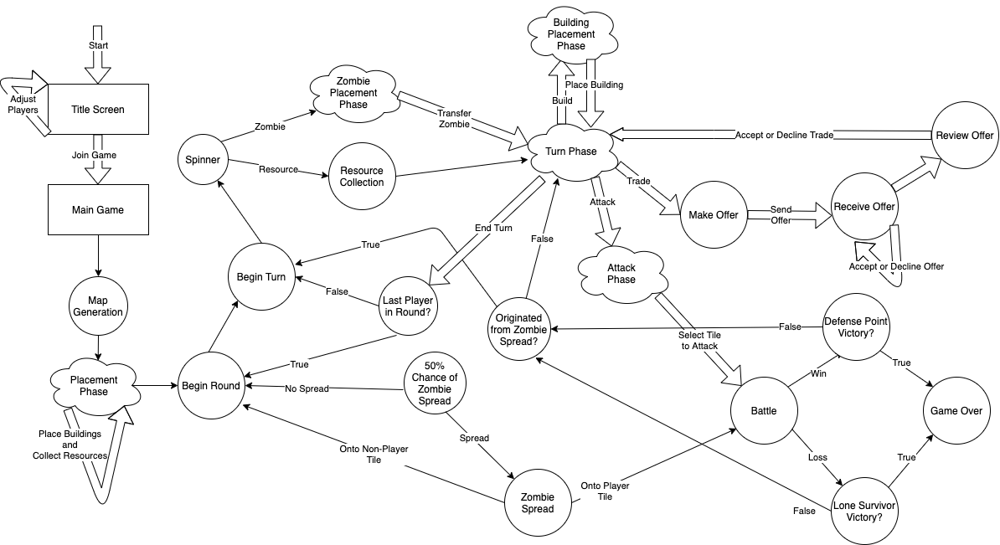
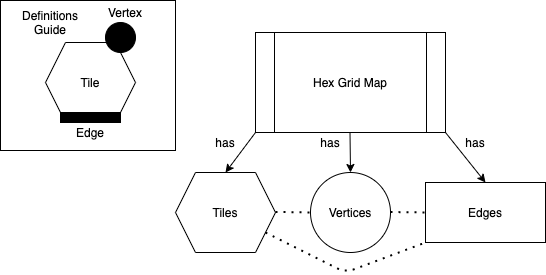
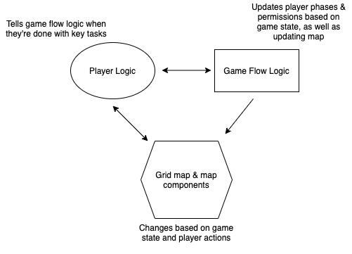

# 6.3 CSC and CSU Descriptions  

# 6.3.1  Detailed Class Descriptions  
The following sections provide the details of all classes used in the Settlers of K'tah application.
## 6.3.1.1  Title Screen  
Title screen that shows when the application begins to greet users.
### 6.3.1.1.1  Set Players Panel  
* Add Players Button
    * This button is enabled when there are less than four players in the game. When enabled and clicked, a new player is added to the list of players.
* Remove Players Button
    * This button is enabled when there are more than two players in the game. When enabled and clicked, the last player on the list of players is removed.
* Players List
    * Each item in the list has a text field with unique colored background to allow users to input the player name.
### 6.3.1.1.2  Start Game Button  
* Allows users to enter the main game scene and begin gameplay.

## 6.3.1.2  Main Game Scene  
Main screen that comprises the actual gameplay and interactions between players and assets.
### 6.3.1.2.1  Action Panel  
Menus that allow for player interaction during their turn in the game.
* Build Button  
    * Button that opens the build panel and hides the action panel.
* Trade Button  
    * Button that opens the trade view and hides the action panel.
* Attack Button  
    * Button that allows player to initiate an attack on a zombie-infected tile.
* End Turn Button  
    * Button that ends the current player's turn and initiates the next player's turn.
* Build Panel  
    * Outpost Button  
        * If the player has enough resources, the button is enabled and allows the player to place an outpost on a valid vertex. The valid vertices for outpost placement are highlighted and then un-highlighted when the player places the outpost.
    * Road Button  
        * If the player has enough resources, the button is enabled and allows the player to place a road on a valid edge. The valid edges for road placement are highlighted and then un-highlighted when the player places the road.
    * Knight Button  
        * If the player has enough resources, the button is enabled and allows the player to purchase a knight. The number of knights owned by the player is updated accordingly on the Player Panel.
    * Cancel Button  
        * Button that allows players to return to the action panel; hides the build panel and displays the action panel.
* Trade Modal Views  
    * Make Offer View -- shown when trade button is clicked
        * Give Panel -- allows the player to select the amount of resources they wish to trade away
        * Receive Panel -- allows the player to select the amount of resources they wish to receive
        * Make Offer Button -- allows the player to propose the offer to the other players
        * Cancel Button -- allows the player to return to the action panel
    * Receive Offer View -- shown to other players when a player makes a trade offer
        * Give Panel -- shows the amount of resources the offering player wishes to trade away
        * Receive Panel -- shows the amount of resources the offering player wishes to receive
        * Accept Offer Button -- allows the player to accept the trade offer
        * Decline Offer Button -- allows the player to decline the trade offer
    * Review Offer View -- shown to the offering player when all other players have responded to the trade offer
        * Results List -- displays the result of the offer (whether each player accepts/denies the offer)
        * Cancel Button -- allows the player to cancel the trade and return to the action panel

### 6.3.1.2.2  Game Status Panels  
Panels that provide players with important information on the game status throughout the game.  
* Player Panel -- displays the list of players and their in-game stats
    * Player Profile
        * Player Name -- displays the player's name
        * Player Avatar -- displays the player's avatar
        * Research Points -- displays the player's current number of research points
        * Defense Points -- displays the player's current number of defense points
        * Number of Knights -- displays the player's current number of knights
    * Zombie Profile
        * Panel that shows the number of tiles currently infected by zombies.
* Resource Panel  
    * Panel that displays the number of resources currently owned by the player.
* Game Log  
    * Text panel that shows important in-game updates such as whose turn it is and the result of the resource spinner.

### 6.3.1.2.3  Game Board  
Interactive game board that displays gameplay.  
* Spinner  
    * The spinner is triggered at the start of every player's turn to select a random resource to be harvested at that turn.
* Hex Tile  
    * Tile Space
        * Bounty -- number that indicates the amount of resources that a player can harvest from the tile
        * Castle -- placed by a player on a hex tile during placement phase
    * Tile Vertices -- spaces that allow for outpost placement
    * Tile Edges -- spaces that allow for road placement

## 6.3.1.3  Internal Player Information  
A class that holds all player-specific information that are important to gameplay.
* Player name
    * A text field that holds the player's display name.
* Player-owned tiles
    * The tiles that are owned by the player (where the player has placed a castle).
* Player-owned vertices
    * The vertices that are owned by the player (where the player has placed an outpost).
* Player-owned edges
    * The edges that are owned by the player (where the player has placed a road).
* Number of resources
    * The number of resources currently owned by the player.
* Number of knights
    * The number of knights currently owned by the player.
* Number of research points
    * The number of research points that the player currently has.
* Number of defense points
    * The number of defense points that the player currently has.
* Whether player is out of game
    * A boolean that indicates whether the player is out of the game (if they have lost both their castles).

# 6.3.2  Detailed Interface Descriptions  
TODO: Maddie  

# 6.3.3  Detailed Data Structure Descriptions  
## 6.3.3.1  Title Screen  
### 6.3.3.1.1  Set Players Panel  
* Array to hold player names that are input by the users. 
### 6.3.3.1.2  Start Game Button  
* Passes player information (player names) to the main game scene.

## 6.3.3.2  Main Game Scene  
### 6.3.1.2.1  Action Panel  
* Dictionaries that map each buildable item to the amount of resources required to build it.
### 6.3.1.2.2  Game Status Panels  
* Array to hold list of players and their stats.
* Array to hold the game log texts that should be displayed on the screen.
* Dictionary to hold the current player's number of resources.
### 6.3.1.2.3  Game Board  
* Array to hold all hexagon tiles that are on the game board.
* Within each hexagon tile:
    * Dictionary to map each tile's edge to a hexagon edge asset. 
    * Dictionary to map each tile's vertex to a hexagon vertex asset. 
    * Array to hold all adjacent hexagon tiles.
* Within each hexagon vertex:
    * Array to hold all adjacent hexagon tiles.
    * Array to hold all adjacent hexagon edges.
* Within each hexagon edge:
    * Array to hold all adjacent hexagon tiles.
    * Array to hold all adjacent hexagon vertices.

## 6.3.3.3  Internal Player Information  
* String to hold the player's display name.
* Arrays to hold the player-owned tiles, vertices and edges.
* Dictionary that maps each resource type to the amount of that resource that the player currently owns.
* Integers to hold the number of knights owned by the player, and their research and defense points.
* Boolean to indicate whether the player is still in the game.

# 6.3.4  Detailed Design Diagrams  
Game State Diagram  

Hex Grid Relational Diagram  

Logic Interaction Diagram   

