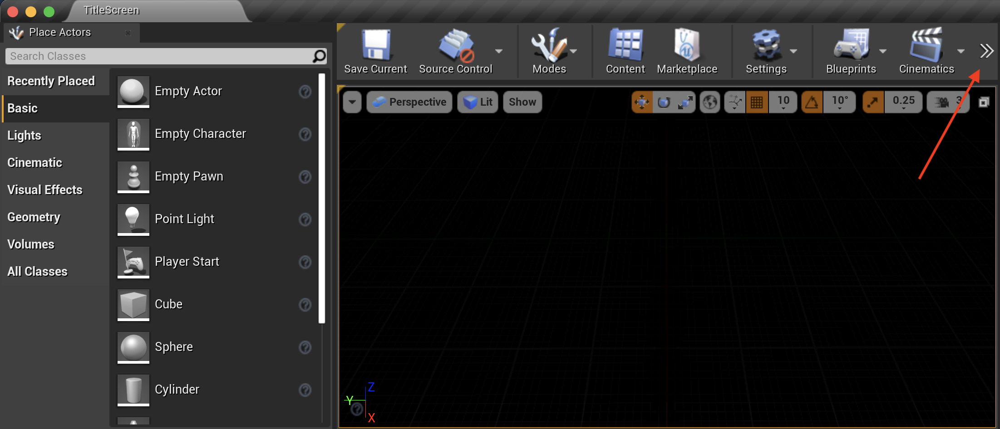
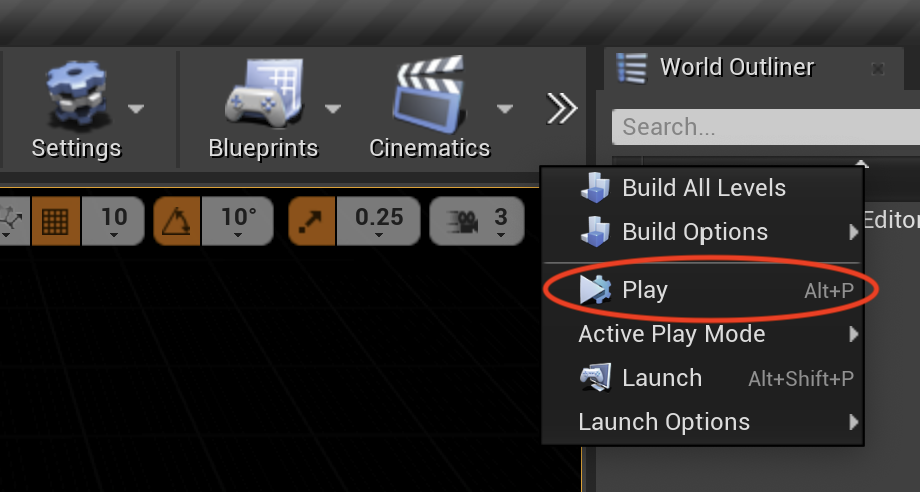
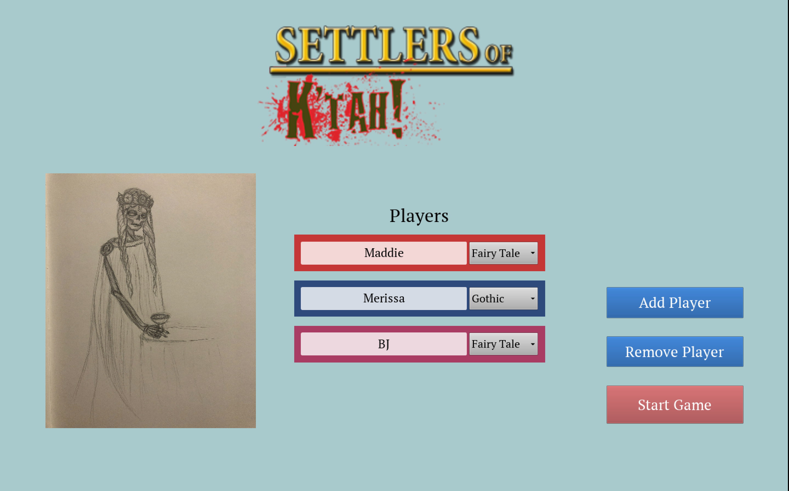
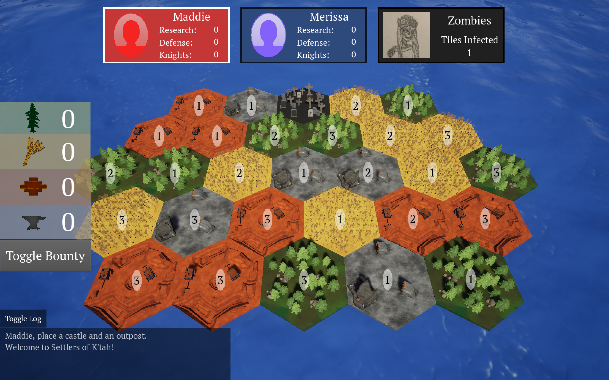
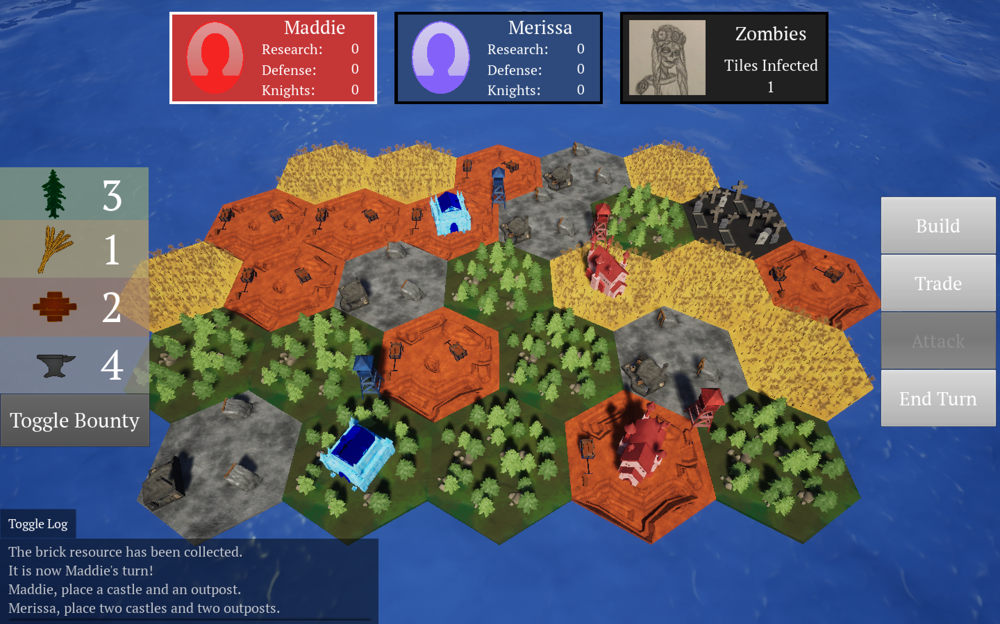

# Settlers of K'tah User Manual

The following manual guides you through the installation and usage of Settlers of K'tah, a 3D video board game made in Unreal Engine.

## How to Install Settlers of K'tah
At the time where this document is written, Settlers of K'tah only supports local multiplayer, and therefore is not hosted on any site. An exported version of the game is available only to a small set of test players. However, the application's repository is public, and users can clone the repository and play the game through the Unreal Engine editor by following the instructions below.

### Downloading and Installing Unreal Engine

To download and install Unreal Engine, follow the instructions [here](https://www.unrealengine.com/en-US/download) and select the Creators License. You might be prompted to log onto an Epic Games account. If you do not already have an Epic Games account, feel free to create one with your email, or simply link Epic Games to your existing Google, Facebook, Xbox Live, Playstation Network, Nintendo, Steam, or Apple account.

The downloaded file's extension will vary based on your operating system. Once the download completes, simply install the application based on how you would install any application onto your operating system.  
For reference, here is a quick external guide on how to install applications on [Windows](https://www.computerhope.com/issues/ch000561.htm#windows) and [Mac](https://support.apple.com/guide/mac-help/install-and-uninstall-other-apps-mh35835/mac).

### Cloning the Settlers of K'tah Repository

Navigate to the command line interface on your operating system (Terminal on Mac, Command Prompt on Windows), and run the following command. This command will download the Settlers of K'tah repository onto your computer and allow you to open the project in Unreal Engine. Note that this might take a few minutes to run because the repository contains a large amount of rendered assets and package contents.
```
git clone https://github.com/mlouis2/Settlers-Of-Ktah.git
```

Once the clone is complete, navigate to the folder where you cloned the repository, and you should see the Settlers of K'tah Unreal project (`file name SettlersOfKtah.uproject`) in `Settlers-of-Ktah > src > SettlersOfKtah`.  

## How to Start Settlers of K'tah

Once you have completed the Unreal Engine installation, simply navigate to the Settlers of K'tah project file (directions above) and open the application. When you open Unreal Engine for the first time, the application might prompt you to create an Epic Games account. Simply log in with the method you used to create your account when downloading Unreal Engine.  

You might also see the following error, or something similar to it:  
  
Do not be alarmed! Your computer simply does not have the necessary build files to run Settlers of K'tah at the moment, so go ahead and click `Yes` and Unreal Engine will build those required components for you.

If all is well, you should see the following screen.  
  

To start the application in the editor, we will hit `Play` in Unreal Engine. If you do not see the `Play` button in the top panel, you might need to expand the panel first.  
  

Hit `Play` or use the `Alt-P` shortcut to start the Settlers of K'tah application.  
  

You should then be greeted by the Settlers of K'tah title screen.   
  

## How to Stop Settlers of K'tah

Whenever the Settlers of K'tah application is running in Unreal Engine, you can stop it by navigating to the same place where the `Play` button is, and hit the `Stop` button. You may also hit the `Escape` key on your keyboard to stop the application at any time.  
  

## How to Uninstall Settlers of K'tah

To uninstall Settlers of K'tah, simply quit the Unreal Engine application, navigate to the directory where you [cloned the repo](#cloning-the-settlers-of-ktah-repository) and delete the `Settlers-of-Ktah` directory. If you wish to uninstall Unreal Engine from your machine, please follow the appropriate instructions for uninstalling applications on your operating system.  

For reference, here is a quick external guide on how to uninstall applications on [Windows](https://www.cnet.com/how-to/how-to-uninstall-an-app-or-program-in-windows-10/) and [Mac](https://support.apple.com/guide/mac-help/install-and-uninstall-other-apps-mh35835/mac).

## Playing Settlers of K'tah  
  
### Title Screen  
  
  
The title screen is where you can set up the game for 2-4 players. Select "Add Player" or "Remove Player" to adjust the player amount, click the the text boxes in the middle to change players' names, and select the dropdown next to the text box to select one of two castle styles per player.  
When all players are satisifed with the set-up, click "Start Game" to begin.  
  
### Placement Phase  
  
  
The game begins with the Placement Phase. Follow the instructions in the Game Log (bottom-left hand of the screen) in order to proceed. Each player will place two castles and two outposts following snake order (player 1, player 2, player 1). Players should place their buildings strategically in order to gain as many resources as possible, while also avoiding the Zombie Hub tile (see back middle of image).  
  
  
This image shows what the game should look like when the Placement Phase has been completed. Note that each player has two castles and two outposts.
  
### Turn Phase  
   
  
The majority of the game takes place in the Turn Phase. Click the "Toggle Bounty" button on the left in order to turn the bounty numbers on each tile on and off. Refer to the Game Log in the bottom-left hand corner of the screen for game updates and instructions.  
Players can perform actions on their turn using the Action Panel on the right-hand side of the screen. Build shows players options for different items they can create with their resources (outposts, roads, knights). Trade allows the player to trade with the Bank by turning in 6 of any resource for 1 of any other resource, or to propose a trade deal with other players. The "Attack" button enables when an Infected tile is adjacent to the current player's outpost--it allows the player to fight off the Zombie horde using the Knights that they have built. Lastly, "End Turn" progresses the game to the next player's turn.  
  
### Zombie Spread Phase
  
  
One random encounter worth mentioning is the Zombie Spread phase. This is possible when the Horde has infected at least 2 tiles (indicated by the number in the top-right corner of the screen), and has a 1/5 chance of occuring each turn. The current player must select one of the highlighted tiles to move to a location of their choice on the map. Then, they must select where they would like it to move to, which will also be indicated by highlights.  
  
### Game Over  
   
There are two possible ways for the game to end. Firstly, a Lone Survivor Victory, which means that all players except one have lost both of their castles to the Zombie Horde. This occurs through random Zombie spread each round. The other possible victory is a Military Victory, which means that the winning player has successfully fought off the Zombie Horde with their Knights 10 times.  
When this modal view appears, the player can click "Return to Title Screen" in order to reset the application.  
  

## Troubleshooting Common Problems

Below are some problems that you might encounter when installing or starting Settlers of K'tah, with possible solutions for each:

### Settlers of K'tah failing to build

When opening the Settlers of K'tah application for the first time, it is not unusual to be prompted to re-build either the project modules or the editor. However, sometimes you might run into an error during the compilation:  
  
This error will stop you from opening the Settlers of K'tah application! :(  
* If you are on a Mac machine, make sure that you have Xcode installed-- this could be the reason the compilation is failing.
* There is a known bug involving macOS Big Sur (version 11) and Xcode 12 that stops users from building Unreal projects. A fix for this bug is included in Unreal Engine version 4.26. If you suspect that this is the cause of the error, make sure to install or update to this latest version of Unreal Engine (at the time this document is written).

### Unreal Engine looks different than the [Start Guide](#How-to-Start-Settlers-of-Ktah)
If you are not seeing the screen shown on the screenshot above when opening the Settlers of K'tah project in Unreal Engine, you might need to switch tabs and navigate to the `Title Screen` tab in the editor.  
  

### Title Screen not showing when Play Button is clicked
If you are not seeing the Settlers of K'tah title screen as shown in the [Start Guide](#How-to-Start-Settlers-of-Ktah) when you click the Play Button, Unreal Engine might be opening the wrong level. In the `Content Browser` at the bottom of the screen, navigate to `Contents > Maps` and open the Title Screen map by double clicking on it.  
  

### If all else fails...
If you run into any significant issues that aren't listed above, first and foremost, make sure you have the latest version of Settlers of K'tah downloaded! You can pull the latest version by going to your command line, navigating to the repository directory and running `git pull`. The Settlers of K'tah engineers are always hard at work fixing bugs, so we might just have fixed the bug that's causing your problem! If you're still having issues, reach out to our engineers through their contact information below!

## Have Additional Questions or Feedback?
In the event that you require assistance to install or run Settlers of K'tah, or if you simply have suggestions or feedback on the application, feel free to contact the Settlers of K'tah engineers listed below, and we will try our best to get back to you as soon as possible!
* [Maddie Louis](mailto:mlouis2@lion.lmu.edu)
* [Merissa Tan](mailto:ltan5@lion.lmu.edu)
