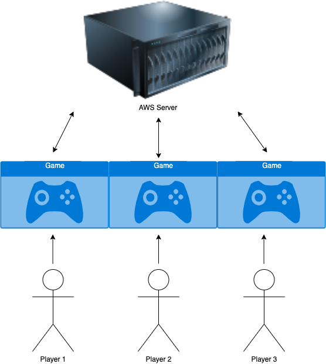

# 5.0 Requirements Specification

## 5.1 Introduction
### 5.1.1 Description
This Software Requirements Specification document details the requirements for "Settlers of K'tah", a multi-player 3D board game that will be created using Unreal Engine. Players will take turns performing strategic actions such as building various types of structures, fighting off the enemy zombie horde, and trading with other players in the game. There will be a title screen where players can select various settings, the main game scene, as well as a mini-game that occurs when there is a battle between a player and the zombie horde. The game will be created using the Unreal Engine blueprint system as well as C++.

### 5.1.2 Diagram

## 5.2 CSCI Component Breakdown

## 5.3 Functional Requirements by CSC
### 5.3.1->n Functional Requirements

## 5.4 Performance Requirements by CSC
### 5.4.1->n Performance Requirements

## 5.5 Project Environment Requirements
### 5.5.1 Development Environment Requirements
### 5.5.2 Execution Environment Requirements
